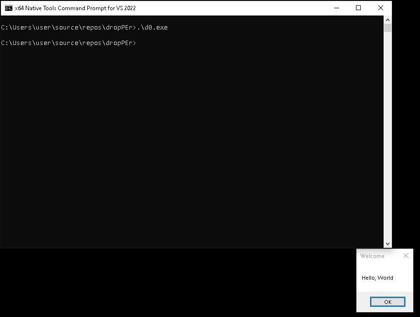

# dropPEr

My solution to the final assignment for:
[SEKTOR7 - RED TEAM Operator: Malware Development Essentials](https://institute.sektor7.net/red-team-operator-malware-development-essentials).

`dropPEr` is a Windows dropper that:

* AES-encrypts the payload at rest (resource section).
* AES-encrypts embedded strings (DLL names, API names).
* Obfuscates API resolution by decrypting names at runtime and resolving via `GetProcAddress`.

The payload (`msgbox64.bin`) is a benign message box, generated for x64 using `msfvenom`:

```sh
msfvenom -p windows/x64/messagebox TEXT="Hello, World!" TITLE="Welcome" EXITFUNC=thread -f raw -o msgbox64.bin
```

## Build & Run

From an x64 Native Tools Command Prompt for VS:

```sh
compile.bat
.\d0.exe
```

> If you re-run `aesencrypt.py`, copy the encrypted output into the preprocessor block in `implant.cpp`
 before rebuilding.

When you execute, you should see the simple message box:



## How it works...

At build time, `aesencrypt.py` encrypts two things: the benign payload and the string literals the 
program needs later (DLL/API names). The payload ciphertext is embedded as opaque `RT_RCDATA` via 
`resource.rc`, and the encrypted strings are emitted as C byte arrays so  nothing sensitive is stored
in plaintext on disk.

At runtime, the program first decrypts its string table and resolves required Win32 APIs dynamically,
keeping imports out of the static table. It then loads the payload bytes from the resource section,
decrypts them in memory with the same AES parameters, identifies a target user process and performs
three high-level actions: (1) obtains a handle with appropriate rights, (2) prepares a memory region
in that process and copies the  already-decrypted payload, and (3) asks the target to start a thread
at that region. No plaintext payload or API names are present on disk; they exist only transiently in
memory after decryption.